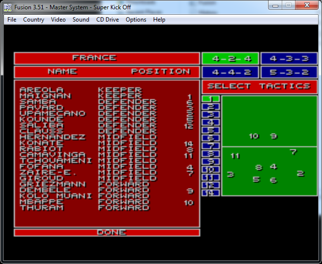
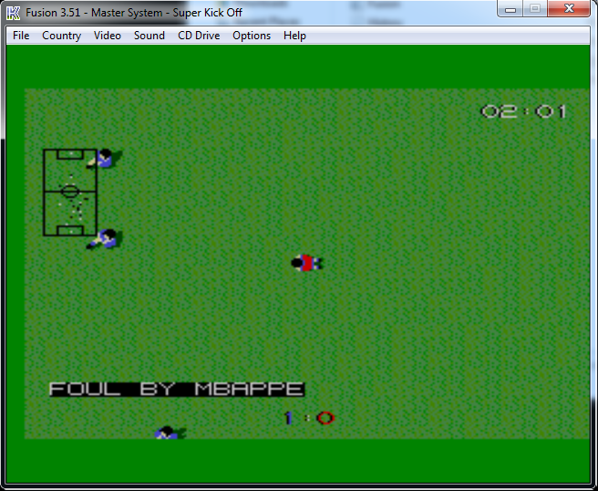

# Super Kick Off Tweaks

Tweak the lists of international players that appear in the soccer game Super Kick Off for Master System II emulator Kega Fusion.
Download: see https://github.com/vigi97la/SuperKickOffTweaks/releases. You will need also `Super Kick Off.sms` and Kega Fusion emulator.

[//]: # (
This is a multi-line comment.
You can write as many lines as you want in this comment.
Just make sure you keep everything within the parentheses.
)

  
   

## SKOPlayersImport

Please update `players.csv` with your custom player names (in ASCII-compatible capital letters, max 10 characters, end with a dot if too long, do not specify the surname) in the international teams (cities not supported), at their expected positions and status.
Then, ensure `Super Kick Off.sms` file (should be exactly 262144 bytes) is in the folder and launch `SKOPlayersImport.exe` to update the file (backup it before!).

## SKOPlayersExport

Read `Super Kick Off.sms` and generate `players.csv` from it: list of player `names;country;team (International or City);position (Keeper, Defender, Midfield or Forward);status (Starter or Substitute)`.

## Rebuilding the executables

Use e.g. Visual Studio 2022 Community and open `CMakeLists.txt` as a CMake project, etc.
